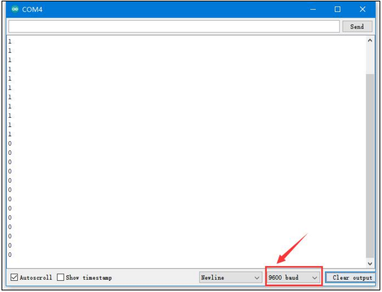

# 1. Touch Sensor User Manual

## 1.1 Introduction to Touch Sensor

### 1.1.1 Sensor Introduction

This is a capacitive touch sensor designed for controlling devices, such as switching lights on and off or operating doorbell buttons. The sensor features LEGO-compatible mounting holes, allowing for creative DIY projects.

### 1.1.2 Working Principle

The sensor detects human touch or metal contact via a gold-plated contact surface. When no human or metal object is in contact with the sensor, the signal pin outputs a high voltage. When a human or metal object touches the surface, the signal pin outputs a low voltage.

Additionally, the sensor can detect touch through materials such as plastic or paper, with sensitivity depending on the size of the contact surface and the thickness of the material.

When the sensor detects touch, the LED light located at the bottom-left corner of the metal surface will illuminate, indicating that human or metal contact has been detected.

When the metal surface is touched, the LED light at the bottom-left corner will light up, signaling that contact with either a human or metal object has been detected.

## 1.2 Notice

* **Do not exceed the specified voltage range during use.**

* **The sensor only detects conductive materials such as the human body or metal. It will not respond to non-conductive materials.**

* **Touching the sensor through materials like plastic or paper is possible, but the thickness of the covering material should be minimal. Otherwise, the sensor may fail to detect the touch.**

* **The sensitivity of the sensor is affected by the size of the contact surface and the thickness of the covering material. Ensure that the contact area is appropriately sized for optimal detection.**

## 1.3 Parameters Instruction

For details about the chip used in this module, please refer to "**[3. Chip Manual and Schematic]()**"

### 1.3.1 Pin Description

<table class="docutils-nobg" border="1">
  <thead>
    <tr>
      <th>PIN</th>
      <th>PIN Instruction</th>
    </tr>
  </thead>
  <tbody>
    <tr>
      <td>5V</td>
      <td>Power Supply</td>
    </tr>
    <tr>
      <td>GND</td>
      <td>Ground cable</td>
    </tr>
    <tr>
      <td>OUT</td>
      <td>When sensor does not detect the contact, OUT terminal will output high level signal (1). When the contact is detected, OUT terminal will output low level signal (0).</td>
    </tr>
    <tr>
      <td>NC</td>
      <td>Empty</td>
    </tr>
  </tbody>
</table>

## 1.3.2 Specification

<table class="docutils-nobg" border="1">
  <tr>
    <td colspan="2" style="text-align: center;"><b>Touch Sensor</b></td>
  </tr>
  <tr>
    <td>Working voltage</td>
    <td>DC 5V</td>
  </tr>
  <tr>
    <td>Working current</td>
    <td>5mA</td>
  </tr>
  <tr>
    <td>Port type</td>
    <td>5264-4AW</td>
  </tr>
  <tr>
    <td>Pin number</td>
    <td>4</td>
  </tr>
  <tr>
    <td>PWR indicator instruction</td>
    <td>Lighting up after powering</td>
  </tr>
  <tr>
    <td>Size</td>
    <td>50mmx20mm</td>
  </tr>
  <tr>
    <td>LED1 instruction</td>
    <td>Lights up when touch is detected</td>
  </tr>
  <tr>
    <td colspan="2">Easy to install, compatible with Lego series</td>
  </tr>
</table>

## 1.4 Program Outcome

You can find additional example tutorials and programs for different platforms in the same directory as this guide. This tutorial uses the Arduino IDE as an example to demonstrate the test results.

In this test, we use the touch sensor to detect whether there is any contact with the human body. Initially, when the sensor is not touched, it outputs a high voltage through the OUT pin, causing the LED1 on the sensor to remain off. The serial monitor will display **"1."**

When the sensor is touched by a finger, it outputs a low voltage through the OUT pin. At this point, LED1 will light up, and the serial monitor will display **"0."**

