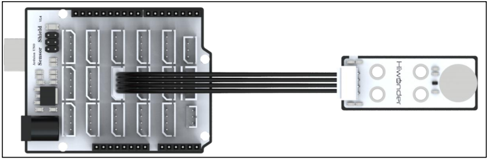
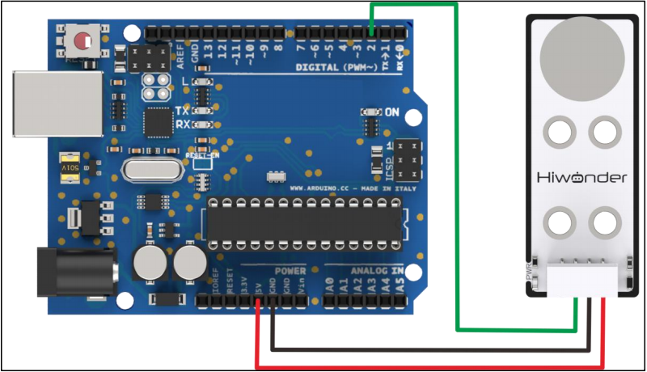
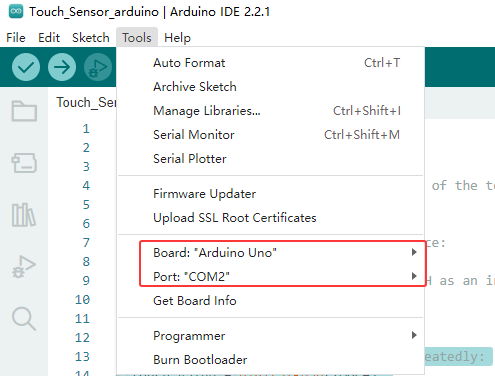
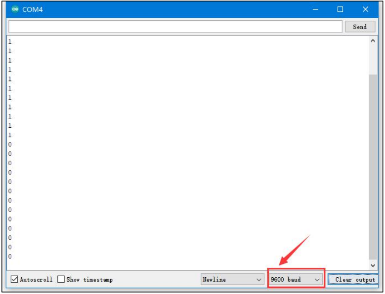

# 2. Arduino Development Tutorial


## 2.1 Preparation

### 2.1.1 Wiring Instructions

Connect the the sensor to the port A2 and A3 of the Arduino expansion board using 4Pin wire.



If you don't have an Arduino expansion board, you can directly connect the Arduino development board using jumper wires. The connection diagram is provided below:



:::{Note}

* If you're using our lithium battery, make sure to connect the red wire to the + and the black wire to the - on the DC port.

* If you're not using a battery, don't connect the battery wires directly to the battery terminals to avoid a short circuit.

* Before powering up, double-check that no metal objects are touching the controller. If they do, it could cause a short circuit through the pins on the bottom and damage the board.

:::

### 2.1.2 Environment Configuration

Install the Arduino IDE on your computer. The installation package is located under "**[Arduino Installation Package](Appendix.md)**." For detailed instructions on using the Arduino IDE, please refer to the corresponding directory.

## 2.2 Test Case

[source code](../_static/source_code/Touch_Sensor_arduino.zip)

The case displays the status detected by the touch sensor through the terminal window.

### 2.2.1 Program Download

Connect the Arduino UNO development board with the expansion board to the computer via a USB cable. Open the Arduino IDE, click on **"File -&gt; New"** and import the program located in the same directory as this tutorial.

Select the correct development board and port (the port shown below is just an example; please use the actual one connected). Compile and upload the program.



After the code is successfully uploaded, click to open the Serial Monitor, set the baud rate to 9600, and observe the behavior.

### 2.2.2 Program Outcome

We use the touch sensor to monitor its touch detection. At the start, if the metal surface isn't touched, the sensor won't register any input, and the Serial Monitor will show a **"1"**. When you touch the metal surface with your finger, the sensor detects the touch, LED1 lights up, and the Serial Monitor will display a **"0"**.



### 2.2.3 Brief Program Analysis

-   **Interface Definition**

{lineno-start=4}
```cpp
#define TOUCH 2  //Define the signal pin of the touch sensor, connected to digital pin 2 on the control board.
uint8_t touch_value;
```

First, the interface for the touch sensor is defined, with the OUT pin connected to D2. touch_value stores the output value from the touch sensor.

-   **Serial Port Initialization**

{lineno-start=6}
```cpp
void setup() {
  // put your setup code here, to run once:
  Serial.begin(9600);
  pinMode(TOUCH, INPUT);//Configure TOUCH as an input (input mode is typically used to read the state of this pin, i.e., to capture the feedback value from the sensor).
}
```

After initializing the serial port, set the D2 pin to input mode.

- **Loop Execution**

{lineno-start=12}

```cpp
void loop() {
  // put your main code here, to run repeatedly:
  touch_value = digitalRead(TOUCH);
  Serial.println(touch_value);
  delay(500);
}
```

In the loop() function, data is collected and output.

digitalRead reads the D2 pin's signal level and stores it in the touch_value variable, capturing the high or low state. Then, it prints the sampled result. By repeatedly touching the metal surface, observe the changes in the data printed on the Serial Monitor.