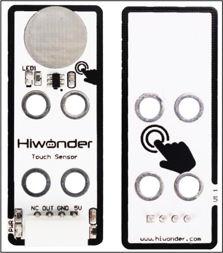
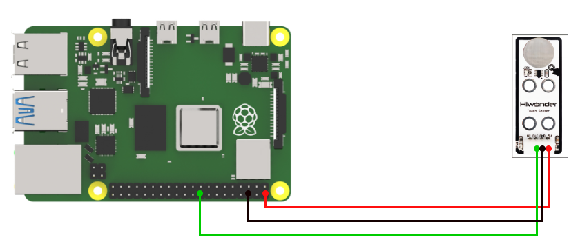

# 3. Raspberry Pi Development Tutorial



## 3.1 Preparation

### 3.1.1 Wiring Instructions

Connect the touch sensor to the controller using the DuPont wire as below.



:::{Note}

* If you're using our lithium battery, make sure to connect the red wire to the + and the black wire to the - on the DC port.

* If you're not using a battery, don’t connect the battery wires directly to the battery terminals to avoid a short circuit.

:::

### 3.1.2 Environment Configuration

Install the NoMachine on your computer. The installation package is located under "**[2 Software Tools & Program Collection -> 01 Software Installation Packages -> Remote Desktop Installation Tool.](Appendix.md)**" For detailed instructions on using the NoMachine, please refer to the corresponding directory.

Transfer the program and the SDK library files to the Raspberry Pi system image. For this example, we'll place them on the desktop. Note: Ensure that the library files are in the same directory as the program.

Next, open the terminal and use the following command to navigate to the directory containing the program: 
sudo chmod a+x Sensor_Demo


## 3.2 Test Case

The case displays the status detected by the touch sensor through the terminal window.

### 3.2.1 Program Download

* **Next, open the terminal and use the following command to navigate to the directory containing the program:** 

```bash
  cd Desktop/Sensor_Demo/
```


* **Enter the following command to run the program for this example: python3 TouchSensorDemo.py**


### 3.2.2 Program Outcome

We use the touch sensor to monitor its touch detection. At first, when the metal surface isn't touched, the sensor doesn't detect any input, and the terminal window shows **"1"** .
Once you touch the metal surface with your finger, the sensor detects the touch, the LED1 lights up, and the terminal window shows **"0"**.


## 3.3 Brief Program Analysis

-   **Library Files Import**

{lineno-start=2}

```python
import os
import sys
import time
import RPi.GPIO as GPIO
```

Import the necessary library files for the program, including system libraries, the delay library, and the GPIO library.

-   **Serial Port Initialization**

{lineno-start=7}

```python
GPIO.setwarnings(False)
GPIO.setmode(GPIO.BCM)

if sys.version_info.major == 2:
    print('Please run this program with python3!')
    sys.exit(0)
```

In this step, the GPIO pins are initialized, and the GPIO mode is set to BCM mode.

-   **Main Function**

{lineno-start=5}

```python
while True:
    GPIO.setup(24, GPIO.IN) #Set the pin as the input code
    state = GPIO.input(24)  #Read the pin value
    print('OUT:',state)
    
    time.sleep(0.2)
```

Inside the while loop, set GPIO pin 24 to input mode, then store the input signal from pin 24 into the state variable.

Finally, print the value of the state variable in the terminal window.