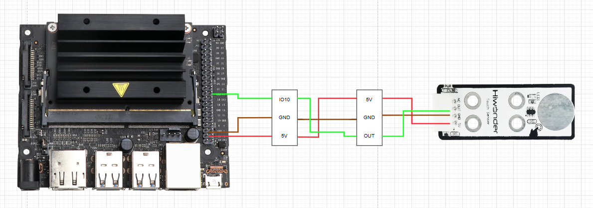

# 4. Jetson Nano Development Tutorial


## 4.1 Preparation

### 4.1.1 Wiring Instructions

Connect the touch sensor to the controller using the DuPont wire as below.



**Before powering up, double-check that no metal objects are touching the controller. If they do, it could cause a short circuit through the pins on the bottom and damage the board.**

### 4.1.2 Environment Configuration

Install the NoMachine on your computer. The installation package is located under **"[2 Software Tools & Program Collection -&gt; 01 Software Installation Packages -&gt; Remote Desktop Installation Tool](Appendix.md)".** For detailed instructions on using the NoMachine, please refer to the corresponding directory.

Transfer the program into the Jetson Nano system image. For this example, we’ll place it on the desktop.

## 4.2 Test Case

This example displays the status detected by the touch sensor in the terminal window of the Jetson system.

### 4.2.1 Program Download

1.  Next, open the terminal and use the following command to navigate to the directory containing the program: 

**"cd Desktop/Sensor_Demo/"**


2.  Enter the following command to run the program for this example: **"python3 touch_sensor.py"**


### 4.2.2 Program Outcome

We use the touch sensor to monitor its touch detection. At first, when the metal surface isn't touched, the sensor doesn't detect any input, and the terminal window shows **"1"** 
Once you touch the metal surface with your finger, the sensor detects the touch, the LED1 lights up, and the terminal window shows **"0"**.


### 4.2.3 Brief Program Analysis

-   **Library Files Import**

{lineno-start=3}

```python
import Jetson.GPIO as GPIO
import time
```

Import the necessary library files for the program, including system libraries, the delay library, and the GPIO library.

-   **Serial Port Initialization**

{lineno-start=15}

```python
    #初始化io口
    GPIO.setmode(GPIO.BCM)
    GPIO.setup(10, GPIO.IN)
```

The GPIO pins are initialized with the mode set to BCM. Pin 10, which is used by the touch sensor module, is configured as an input.

-   **Main Function**


In the while loop, the data from GPIO pin 10 is stored in the state variable. The value of state is then printed, and the output is refreshed every 0.5 seconds in a continuous loop.
